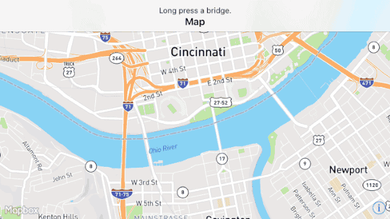

# Roebling

Feature querying and Wikidata in a Mapbox-powered iOS application. Long press on a bridge to see Wikimedia Commons photographs of other structures designed by the same architect or civil engineer.



Use [CocoaPods](http://cocoapods.org/) to install the application’s dependencies:

```bash
pod install
open Roebling.xcworkspace
```
